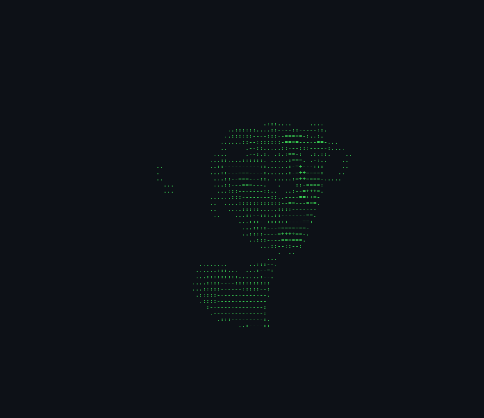

# Olá, eu sou Luiz Wessel 👋

### AI & Computer Vision Developer

Construo sistemas de IA aplicados na prática: pipelines de visão computacional com **YOLO**, IA local com **Ollama**, automação web com **Playwright** e interfaces full-stack de ponta a ponta.

<!-- 🐍 Animação da cobrinha comendo o gráfico de contribuições -->
<picture>
  <source media="(prefers-color-scheme: dark)" srcset="https://raw.githubusercontent.com/Wessel2007/Wessel2007/output/github-contribution-grid-snake-dark.svg" />
  <source media="(prefers-color-scheme: light)" srcset="https://raw.githubusercontent.com/Wessel2007/Wessel2007/output/github-contribution-grid-snake.svg" />
  
</picture>

 

<!-- 🖼️ ASCII art à esquerda + informações à direita -->
<table>
  <tr>
    <td width="50%" align="center">
      
    </td>
    <td width="50%" valign="middle">

### 🧠 Sobre mim

Desenvolvedor focado em **Inteligência Artificial e Visão Computacional**, construindo produtos que saem do notebook e viram sistemas reais em uso: detecção de objetos, agentes que rodam modelos localmente e automações que interagem com a web como um humano faria.

Já são **11 projetos** publicados, divididos entre Computer Vision, Full-Stack e Applied AI — todos reunidos no meu [portfólio](https://wesselproject.vercel.app).

- 🔭 Trabalhando com pipelines de visão computacional (YOLO)
- 🤖 Explorando IA local com Ollama
- 🌐 Automatizando a web com Playwright
- ⚙️ Construindo interfaces full-stack de ponta a ponta

  </td>
  </tr>
</table>

 

## 🛠️ Stack & Ferramentas

 

## 🔗 Links

